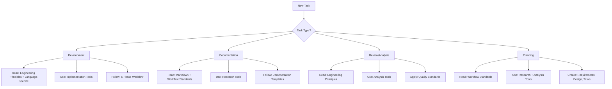

# Instruction Selection & Decision Framework

Quick guide to when and how to apply different instructions, with integrated approach selection for all confidence levels.

## Task-to-Instruction Quick Reference

| Instruction                     | When to Use             | Key Concepts                                |
| ------------------------------- | ----------------------- | ------------------------------------------- |
| **AGENTS.md**                   | Always (auto-applied)   | Core guidelines, workflow, testing approach |
| **Core Engineering Principles** | All development tasks   | SOLID, Clean Code, Testing Strategy         |
| **Workflow Standards**          | All structured work     | 6-Phase Loop, EARS notation, Documentation  |
| **Python**                      | Python code development | Modern syntax, type hints, testing          |
| **Go**                          | Go code development     | Idiomatic Go, interfaces, concurrency       |
| **Markdown**                    | Documentation creation  | Structure, formatting, validation           |
| **Docker**                      | Container development   | Multi-stage, security, optimisation         |
| **Airflow**                     | DAG development         | Airflow 2.10+, DAG structure, testing       |

## Instruction Application by Context

### By File Type

| File Pattern      | Primary Instructions           | Secondary Instructions |
| ----------------- | ------------------------------ | ---------------------- |
| `**/*.py`         | Python, Engineering Principles | Workflow Standards     |
| `**/*.go`         | Go, Engineering Principles     | Workflow Standards     |
| `**/dags/**/*.py` | Airflow, Python                | Engineering Principles |
| `**/*.md`         | Markdown, Workflow Standards   | Engineering Principles |
| `Dockerfile`      | Docker, Engineering Principles | -                      |
| `**` (all files)  | Engineering Principles         | Tool Configurations    |

### By Task Type

| Task                    | Primary Instructions                                           | Tools Needed               |
| ----------------------- | -------------------------------------------------------------- | -------------------------- |
| **Feature Development** | Engineering Principles, Workflow Standards, Language-specific  | Implementation Group       |
| **Code Review**         | Engineering Principles, Language-specific                      | Analysis Group             |
| **Documentation**       | Markdown, Workflow Standards                                   | Research Group             |
| **Testing**             | Engineering Principles, Python (if Python), Workflow Standards | Validation Group           |
| **Containerization**    | Docker, Engineering Principles                                 | Implementation Group       |
| **DAG Development**     | Airflow, Python, Engineering Principles                        | Implementation Group       |
| **Architecture Design** | Engineering Principles, Workflow Standards                     | Analysis + Research Groups |

## Approach Selection by Confidence Level

### Assess Your Confidence First

Ask: Are requirements clear? Is technology familiar? Are there unknowns?

| Situation                             | Confidence | Recommended Approach |
| ------------------------------------- | ---------- | -------------------- |
| **Clear requirements, familiar tech** | >85%       | Standard 6-Phase     |
| **Some unknowns, need validation**    | 66-85%     | Exploratory (PoC)    |
| **Many unknowns, unclear scope**      | <66%       | Research-First       |
| **Emergency fix needed**              | Any        | Minimal Fix + Debt   |

### Detailed Confidence Indicators

**High Confidence (>85%):**

- Requirements are clear and documented
- Technology stack is familiar
- Similar implementations exist
- Success criteria are unambiguous

**Medium Confidence (66-85%):**

- Some requirements need clarification
- Some technology is unfamiliar
- 1-2 unknown dependencies
- Success criteria partially clear

**Low Confidence (<66%):**

- Requirements are ambiguous or incomplete
- Major technology unknowns
- Multiple dependencies unclear
- Significant risk of rework

## Common Task Patterns

### New Feature Development (High Confidence)

1. **Read**: Engineering Principles + Language-specific instructions
2. **Follow**: Workflow Standards (6-phase loop)
3. **Use**: Full Development Tool Group
4. **Create**: requirements.md, design.md, tasks.md

### Code Quality Review

1. **Read**: Engineering Principles
2. **Use**: Analysis Tool Group
3. **Apply**: SOLID principles checklist
4. **Output**: Improvement recommendations

### API Documentation

1. **Read**: Markdown + Workflow Standards
2. **Use**: Research Tool Group
3. **Follow**: Documentation templates
4. **Validate**: Against markdown standards

### Container Development

1. **Read**: Docker + Engineering Principles
2. **Use**: Implementation Tool Group
3. **Apply**: Multi-stage builds, security practices
4. **Test**: Build and run validation

### Test Strategy Design

1. **Read**: Engineering Principles + Python (if applicable)
2. **Use**: Analysis + Validation Tool Groups
3. **Follow**: Test pyramid, AAA pattern
4. **Create**: Comprehensive test suite

### Medium Confidence Work (PoC-First)

1. **Read**: Workflow Standards + Engineering Principles
2. **Follow**: 6-Phase Loop with PoC in Phase 3
3. **Use**: Research + Implementation Groups
4. **Validate**: Early and frequently

### Low Confidence Work (Research-First)

1. **Read**: Workflow Standards for framework
2. **Use**: Research + Analysis Tool Groups
3. **Conduct**: Investigation and learning
4. **Re-assess**: Confidence after learning

## Instruction Summaries (Quick Read Times)

| Instruction                | Core Concepts                                 | Read Time | When   |
| -------------------------- | --------------------------------------------- | --------- | ------ |
| **AGENTS.md**              | Framework guidelines, workflow, testing       | 2 min     | Start  |
| **Engineering Principles** | SOLID, DRY, YAGNI, KISS, Test Pyramid         | 2 min     | Always |
| **Workflow Standards**     | 6-Phase Loop, EARS notation, confidence score | 2 min     | Always |
| **Python**                 | Modern syntax, type hints, testing            | 45 sec    | Python |
| **Go**                     | Idiomatic Go, interfaces, table-driven tests  | 60 sec    | Go     |
| **Markdown**               | Structure, validation, NZ English             | 30 sec    | Docs   |
| **Docker**                 | Multi-stage, security, optimisation           | 90 sec    | Deploy |
| **Airflow**                | DAG structure, idempotence, testing           | 60 sec    | DAGs   |

## Emergency Decision Tree

### "I don't know where to start"

1. **Assess confidence**: Clear requirements? Familiar tech?
2. **Check task type**: Development, documentation, or review?
3. **Read core files**: AGENTS.md (2 min) + task-specific file (1-2 min)
4. **Start Phase 1**: Run ANALYSE phase from Workflow Standards

### "I need to make a decision about technology/approach"

1. **Read**: Engineering Principles (2 min)
2. **Use**: Decision Record template from workflow-standards.md
3. **Document**: Options, rationale, impact, review date
4. **Revisit**: At review date

### "Code isn't following standards"

1. **Identify file type**: Python, Markdown, or Docker?
2. **Read**: Relevant language instruction file (30 sec - 2 min)
3. **Apply**: Specified standards and conventions
4. **Validate**: Run linters/formatters before commit

### "My team is confused about process"

1. **Share**: AGENTS.md (core guidelines)
2. **Reference**: Workflow Standards (6-phase framework)
3. **Point to**: Confidence-based approach selection
4. **Document**: Team-specific customisations separately

## Tool Selection Reference

**Code Analysis Group**: codebase, usages, search, problems, changes, findTestFiles  
→ Use when: Understanding existing code, finding patterns, identifying issues

**Implementation Group**: editFiles, runCommands, runTasks, runTests, new  
→ Use when: Making code changes, executing builds, running tests

**Research Group**: fetch, githubRepo, openSimpleBrowser, searchResults  
→ Use when: External research, documentation lookup, best practices

**Validation Group**: runTests, testFailure, problems, terminalSelection, terminalLastCommand  
→ Use when: Testing, debugging failures, checking results

**Full Development Group**: All tools above combined  
→ Use when: Complete development workflows requiring all capabilities

## When Each Phase Typically Occurs

See **Workflow Standards** for detailed phase descriptions:

- **Phase 1 (Analyse)**: Always required - foundation phase (10-20% of time)
- **Phase 2 (Design)**: Skip only for trivial changes <10 lines (20-30% of time)
- **Phase 3 (Implement)**: Production-quality code (40-50% of time)
- **Phase 4 (Validate)**: Always required for code changes (10-15% of time)
- **Phase 5 (Reflect)**: Skip only for emergency fixes (5-10% of time)
- **Phase 6 (Handoff)**: Always required (5% of time)

**Total typical time**: 100% baseline for High Confidence; +25-50% for Medium/Low Confidence

# Instruction Index

## Quick Reference

| Instruction                     | When to Use             | Key Concepts                                |
| ------------------------------- | ----------------------- | ------------------------------------------- |
| **AGENTS.md**                   | Always (auto-applied)   | Core guidelines, workflow, testing approach |
| **Core Engineering Principles** | All development tasks   | SOLID, Clean Code, Testing Strategy         |
| **Workflow Standards**          | All structured work     | 6-Phase Loop, EARS notation, Documentation  |
| **Python**                      | Python code development | Modern syntax, type hints, testing          |
| **Markdown**                    | Documentation creation  | Structure, formatting, validation           |
| **Docker**                      | Container development   | Multi-stage, security, optimisation         |

## Instruction Application Matrix

### By File Type

| File Pattern     | Primary Instructions           | Secondary Instructions |
| ---------------- | ------------------------------ | ---------------------- |
| `**/*.py`        | Python, Engineering Principles | Workflow Standards     |
| `**/*.go`        | Go, Engineering Principles     | Workflow Standards     |
| `**/*.md`        | Markdown, Workflow Standards   | Engineering Principles |
| `Dockerfile`     | Docker, Engineering Principles | -                      |
| `**` (all files) | Engineering Principles         | Tool Configurations    |

### By Task Type

| Task                    | Primary Instructions                                           | Tools Needed               |
| ----------------------- | -------------------------------------------------------------- | -------------------------- |
| **Feature Development** | Engineering Principles, Workflow Standards, Language-specific  | Implementation Group       |
| **Code Review**         | Engineering Principles, Language-specific                      | Analysis Group             |
| **Documentation**       | Markdown, Workflow Standards                                   | Research Group             |
| **Testing**             | Engineering Principles, Python (if Python), Workflow Standards | Validation Group           |
| **Containerization**    | Docker, Engineering Principles                                 | Implementation Group       |
| **Architecture Design** | Engineering Principles, Workflow Standards                     | Analysis + Research Groups |

## Workflow Decision Tree

## Common Combinations

### New Feature Development

1. **Read**: Engineering Principles + Language-specific instructions
2. **Follow**: Workflow Standards (6-phase loop)
3. **Use**: Full Development Tool Group
4. **Create**: requirements.md, design.md, tasks.md

### Code Quality Review

1. **Read**: Engineering Principles
2. **Use**: Analysis Tool Group
3. **Focus**: SOLID principles, clean code practices
4. **Output**: Improvement recommendations

### API Documentation

1. **Read**: Markdown + Workflow Standards
2. **Use**: Research Tool Group
3. **Follow**: Documentation templates
4. **Validate**: Against markdown standards

### Container Development

1. **Read**: Docker + Engineering Principles
2. **Use**: Implementation Tool Group
3. **Apply**: Multi-stage builds, security practices
4. **Test**: Build and run validation

### Test Strategy Design

1. **Read**: Engineering Principles + Python (if applicable)
2. **Use**: Analysis + Validation Tool Groups
3. **Follow**: Test pyramid, AAA pattern
4. **Create**: Comprehensive test suite

## Confidence-Based Instruction Usage

### High Confidence (>85%)

- **Approach**: Standard 6-Phase Loop
- **Core Focus**: Engineering Principles + Language-specific
- **Documentation**: Standard templates (requirements.md, design.md, tasks.md)
- **Validation**: Comprehensive testing

### Medium/Low Confidence (<85%)

- **Approach**: Exploratory (PoC or Research)
- **Start with**: Workflow Standards + Engineering Principles
- **Process**: Build PoC or research → validate → iterate or proceed
- **Documentation**: Incremental with detailed decision records
- **Validation**: Early and frequent testing of assumptions

## Quick Instruction Summaries

### Engineering Principles (30-second read)

**Core**: SOLID, DRY, YAGNI, KISS + Test Pyramid + Clean Code
**Apply**: Every development task  
**Focus**: Quality, maintainability, testability

### Workflow Standards (60-second read)

**Core**: 6-Phase Loop (Analyse→Design→Implement→Validate→Reflect→Handoff)
**Apply**: All structured work
**Focus**: Documentation, requirements in EARS notation

### Tool Configurations (30-second read)

**Core**: Tool groups for different purposes
**Apply**: When selecting tools for task
**Focus**: Efficient, progressive tool usage

### Python (45-second read)

**Core**: Modern syntax, type hints, testing best practices  
**Apply**: All Python development
**Focus**: PEP 8, readability, maintainability

### Go (60-second read)

**Core**: Idiomatic Go, interfaces, table-driven tests  
**Apply**: All Go development
**Focus**: Simplicity, explicit errors, composition

### Markdown (30-second read)

**Core**: Structure, validation, NZ English
**Apply**: All documentation
**Focus**: Consistency, readability, standards

### Docker (90-second read)

**Core**: Multi-stage builds, security, minimal images
**Apply**: All containerization
**Focus**: Efficiency, security, best practices

## Emergency Quick Reference

### "I need to start coding immediately"

1. Read: Engineering Principles (2 min)
2. Skim: Language-specific (1 min)
3. Start: Phase 1 (Analyse) from Workflow Standards
4. Use: Appropriate tool group

### "I need to review someone's code"

1. Read: Engineering Principles (2 min)
2. Use: Analysis Tool Group
3. Apply: SOLID principles checklist
4. Focus: Clean code practices

### "I need to write documentation"

1. Read: Markdown + Workflow Standards (3 min)
2. Use: Research Tool Group
3. Follow: Documentation templates
4. Validate: Against standards

### "I need to fix/optimise containers"

1. Read: Docker quick reference (90 sec)
2. Focus: Multi-stage, security, size optimisation
3. Use: Implementation Tool Group
4. Test: Build and security validation
