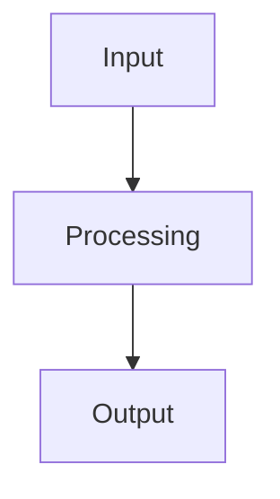

# Specification Templates

## Requirements Template (`requirements.md`)

```markdown
---
title: [Project/Feature Name] Requirements
version: 1.0
date_created: [YYYY-MM-DD]
last_updated: [YYYY-MM-DD]
owner: [Team/Individual]
---

# [Project/Feature Name] Requirements

## Overview

[Brief description of the project/feature purpose and scope]

## Stakeholders

- **Primary Users**: [Who will use this]
- **Business Owner**: [Who owns the business need]
- **Technical Owner**: [Who owns the technical implementation]

## Functional Requirements (EARS Notation)

### Core Features

- **REQ-001**: WHEN [condition/event], THE SYSTEM SHALL [expected behavior]
- **REQ-002**: WHILE [state], THE SYSTEM SHALL [expected behavior]
- **REQ-003**: THE SYSTEM SHALL [ubiquitous behavior]

### Edge Cases

- **REQ-E001**: IF [unwanted condition], THEN THE SYSTEM SHALL [required response]
- **REQ-E002**: WHERE [feature is optional], THE SYSTEM SHALL [expected behavior]

### Error Handling

- **REQ-ERR001**: WHEN [error condition], THE SYSTEM SHALL [error response]

## Non-Functional Requirements

### Performance

- **REQ-PERF001**: THE SYSTEM SHALL respond within [time] for [scenario]
- **REQ-PERF002**: THE SYSTEM SHALL support [number] concurrent users

### Security

- **REQ-SEC001**: THE SYSTEM SHALL authenticate users via [method]
- **REQ-SEC002**: THE SYSTEM SHALL encrypt [data type] using [method]

### Reliability

- **REQ-REL001**: THE SYSTEM SHALL maintain [uptime]% availability
- **REQ-REL002**: THE SYSTEM SHALL recover from failures within [time]

## Constraints

- **Technical**: [Technology limitations, compatibility requirements]
- **Business**: [Budget, timeline, regulatory constraints]
- **Operational**: [Deployment, maintenance, support constraints]

## Dependencies

- **Internal**: [Other systems, components, teams]
- **External**: [Third-party services, APIs, vendors]

## Success Criteria

- [ ] [Measurable outcome 1]
- [ ] [Measurable outcome 2]
- [ ] [Measurable outcome 3]

## Assumptions

- [Assumption 1 with risk if invalid]
- [Assumption 2 with risk if invalid]

## Out of Scope

- [What is explicitly not included]
- [Future considerations]
```

## Design Template (`design.md`)

````markdown
---
title: [Project/Feature Name] Technical Design
version: 1.0
date_created: [YYYY-MM-DD]
last_updated: [YYYY-MM-DD]
owner: [Technical Lead]
---

# [Project/Feature Name] Technical Design

## Architecture Overview

[High-level system architecture diagram and description]

### Components

- **Component 1**: [Purpose, responsibilities, interfaces]
- **Component 2**: [Purpose, responsibilities, interfaces]

### Data Flow


````

[Description of data flow and transformations]

## Interface Specifications

### APIs

```yaml
endpoint: /api/example
method: POST
request:
  schema: [JSON schema or description]
response:
  success: [Success response format]
  error: [Error response format]
```

### Data Models

```sql
-- Example database schema
CREATE TABLE example (
    id UUID PRIMARY KEY,
    name VARCHAR(255) NOT NULL,
    created_at TIMESTAMP DEFAULT NOW()
);
```

### Integration Points

- **System A**: [Integration method, data format, error handling]
- **System B**: [Integration method, data format, error handling]

## Error Handling Strategy

| Error Type          | Detection Method | Response                | Recovery           |
| ------------------- | ---------------- | ----------------------- | ------------------ |
| Validation Error    | Input validation | 400 Bad Request         | User correction    |
| Service Unavailable | Health check     | 503 Service Unavailable | Retry with backoff |
| Data Not Found      | Database query   | 404 Not Found           | Alternative action |

## Security Considerations

- **Authentication**: [Method and implementation]
- **Authorization**: [Permissions and access control]
- **Data Protection**: [Encryption, PII handling]
- **Audit Trail**: [Logging and monitoring]

## Performance Considerations

- **Expected Load**: [Request volume, data volume]
- **Response Times**: [Target performance metrics]
- **Scaling Strategy**: [Horizontal/vertical scaling approach]
- **Caching**: [Cache strategy and invalidation]

## Testing Strategy

- **Unit Tests**: [Components to test, coverage targets]
- **Integration Tests**: [System interactions to validate]
- **End-to-End Tests**: [User journeys to verify]
- **Performance Tests**: [Load testing approach]

## Deployment Strategy

- **Environments**: [Development, staging, production setup]
- **Rollout Plan**: [Deployment phases, rollback strategy]
- **Monitoring**: [Health checks, alerts, metrics]

## Technical Debt and Trade-offs

- **Known Limitations**: [Current constraints and future improvements]
- **Technical Debt**: [Shortcuts taken and remediation plans]
- **Alternative Approaches**: [Options considered and why rejected]

````

## Tasks Template (`tasks.md`)

```markdown
---
title: [Project/Feature Name] Implementation Tasks
version: 1.0
date_created: [YYYY-MM-DD]
last_updated: [YYYY-MM-DD]
owner: [Implementation Lead]
---

# [Project/Feature Name] Implementation Tasks

## Task Overview
Total estimated effort: [X hours/days/weeks]
Critical path: [Key dependencies that affect timeline]

## Phase 1: Foundation
### TASK-001: [Foundation Task Name]
- **Description**: [What needs to be done]
- **Expected Outcome**: [Specific deliverable or result]
- **Dependencies**: [What must be completed first]
- **Effort Estimate**: [Time/complexity estimate]
- **Status**: [ ] Not Started / [ ] In Progress / [ ] Complete
- **Acceptance Criteria**:
  - [ ] [Specific testable criteria]
  - [ ] [Additional criteria]

### TASK-002: [Database Setup]
- **Description**: Create database schema and initial data
- **Expected Outcome**: Functional database with seed data
- **Dependencies**: TASK-001 (Environment setup)
- **Effort Estimate**: 4 hours
- **Status**: [ ] Not Started
- **Acceptance Criteria**:
  - [ ] All tables created with proper constraints
  - [ ] Seed data populated
  - [ ] Database migrations work correctly

## Phase 2: Core Implementation
### TASK-003: [Core Feature Implementation]
- **Description**: [Implementation details]
- **Expected Outcome**: [Working feature with tests]
- **Dependencies**: TASK-001, TASK-002
- **Effort Estimate**: [Estimate]
- **Status**: [ ] Not Started
- **Acceptance Criteria**:
  - [ ] [Functional criteria]
  - [ ] [Quality criteria]
  - [ ] [Test coverage criteria]

## Phase 3: Integration & Testing
### TASK-004: [Integration Testing]
- **Description**: [Integration scope and approach]
- **Expected Outcome**: [Validated integrations]
- **Dependencies**: [Core implementation tasks]
- **Effort Estimate**: [Estimate]
- **Status**: [ ] Not Started

## Phase 4: Deployment & Documentation
### TASK-005: [Deployment Pipeline]
- **Description**: [Deployment setup and configuration]
- **Expected Outcome**: [Automated deployment capability]
- **Dependencies**: [Implementation completion]
- **Effort Estimate**: [Estimate]

## Risk Mitigation Tasks
### TASK-RISK-001: [High-Risk Item]
- **Risk**: [Description of risk]
- **Impact**: [Consequences if risk occurs]
- **Mitigation**: [Specific actions to reduce risk]
- **Contingency**: [Plan if risk occurs]

## Definition of Done
- [ ] All acceptance criteria met
- [ ] Code reviewed and approved
- [ ] Tests written and passing (>80% coverage)
- [ ] Documentation updated
- [ ] Security review completed (if applicable)
- [ ] Performance requirements validated
- [ ] Deployed to staging and validated
- [ ] Stakeholder approval obtained

## Task Dependencies Diagram
```mermaid
graph TD
    TASK001[Environment Setup] --> TASK002[Database Setup]
    TASK001 --> TASK003[Core Implementation]
    TASK002 --> TASK003
    TASK003 --> TASK004[Integration Testing]
    TASK004 --> TASK005[Deployment]
````

## Notes and Decisions

- [Important notes about task planning or decisions made]
- [Changes to original plan and rationale]

````

## Action Documentation Template

```markdown
### [TYPE] - [ACTION] - [TIMESTAMP]
**Objective**: [Goal being accomplished]
**Context**: [Current state, requirements, and reference to prior steps]
**Decision**: [Approach chosen and rationale, referencing the Decision Record if applicable]
**Execution**: [Steps taken with parameters and commands used. For code, include file paths.]
**Output**: [Complete and unabridged results, logs, command outputs, and metrics]
**Validation**: [Success verification method and results. If failed, include a remediation plan.]
**Next**: [Automatic continuation plan to the next specific action]
````

## Decision Record Template

```markdown
### Decision - [TIMESTAMP]

**Decision**: [What was decided]
**Context**: [Situation requiring decision and data driving it]
**Options**: [Alternatives evaluated with brief pros and cons]
**Rationale**: [Why the selected option is superior, with trade-offs explicitly stated]
**Impact**: [Anticipated consequences for implementation, maintainability, and performance]
**Review**: [Conditions or schedule for reassessing this decision]
```

## EARS Notation Quick Reference

- **Ubiquitous**: `THE SYSTEM SHALL [expected behavior]`
- **Event-driven**: `WHEN [trigger event] THE SYSTEM SHALL [expected behavior]`
- **State-driven**: `WHILE [in specific state] THE SYSTEM SHALL [expected behavior]`
- **Unwanted behavior**: `IF [unwanted condition] THEN THE SYSTEM SHALL [required response]`
- **Optional**: `WHERE [feature is included] THE SYSTEM SHALL [expected behavior]`
- **Complex**: Combinations of the above patterns

Each requirement must be: **Testable**, **Unambiguous**, **Necessary**, **Feasible**, **Traceable**
