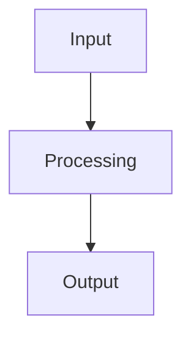
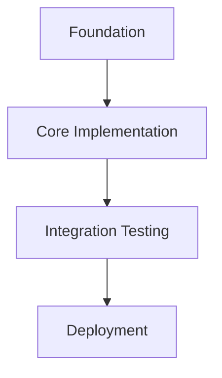

# Engineering Templates

## Table of Contents

1. [requirements.md](#requirementsmd)
2. [design.md](#designmd)
3. [tasks.md](#tasksmd)
4. [Action Documentation](#action-documentation)
5. [Decision Record](#decision-record)
6. [PRD (Product Requirements Document)](#prd)
7. [User Story](#user-story)
8. [Epic Breakdown](#epic-breakdown)
9. [GitHub Issue (from PRD)](#github-issue)

---

## requirements.md

```markdown
---
title: [Project/Feature Name] Requirements
version: 1.0
date_created: [YYYY-MM-DD]
last_updated: [YYYY-MM-DD]
owner: [Team/Individual]
---

# [Project/Feature Name] Requirements

## Overview

[Brief description of the project/feature purpose and scope]

## Stakeholders

- **Primary Users**: [Who will use this]
- **Business Owner**: [Who owns the business need]
- **Technical Owner**: [Who owns the technical implementation]

## Functional Requirements (EARS Notation)

### Core Features

- **REQ-001**: WHEN [condition/event], THE SYSTEM SHALL [expected behavior]
- **REQ-002**: WHILE [state], THE SYSTEM SHALL [expected behavior]
- **REQ-003**: THE SYSTEM SHALL [ubiquitous behavior]

### Edge Cases

- **REQ-E001**: IF [unwanted condition], THEN THE SYSTEM SHALL [required response]
- **REQ-E002**: WHERE [feature is optional], THE SYSTEM SHALL [expected behavior]

### Error Handling

- **REQ-ERR001**: WHEN [error condition], THE SYSTEM SHALL [error response]

## Non-Functional Requirements

### Performance

- **REQ-PERF001**: THE SYSTEM SHALL respond within [time] for [scenario]
- **REQ-PERF002**: THE SYSTEM SHALL support [number] concurrent users

### Security

- **REQ-SEC001**: THE SYSTEM SHALL authenticate users via [method]
- **REQ-SEC002**: THE SYSTEM SHALL encrypt [data type] using [method]

### Reliability

- **REQ-REL001**: THE SYSTEM SHALL maintain [uptime]% availability
- **REQ-REL002**: THE SYSTEM SHALL recover from failures within [time]

## Constraints

- **Technical**: [Technology limitations, compatibility requirements]
- **Business**: [Budget, timeline, regulatory constraints]
- **Operational**: [Deployment, maintenance, support constraints]

## Dependencies

- **Internal**: [Other systems, components, teams]
- **External**: [Third-party services, APIs, vendors]

## Success Criteria

- [ ] [Measurable outcome 1]
- [ ] [Measurable outcome 2]
- [ ] [Measurable outcome 3]

## Assumptions

- [Assumption 1 with risk if invalid]
- [Assumption 2 with risk if invalid]

## Out of Scope

- [What is explicitly not included]
- [Future considerations]
```

---

## design.md

````markdown
---
title: [Project/Feature Name] Technical Design
version: 1.0
date_created: [YYYY-MM-DD]
last_updated: [YYYY-MM-DD]
owner: [Technical Lead]
---

# [Project/Feature Name] Technical Design

## Architecture Overview

[High-level system architecture diagram and description]

### Components

- **Component 1**: [Purpose, responsibilities, interfaces]
- **Component 2**: [Purpose, responsibilities, interfaces]

### Data Flow



[Description of data flow and transformations]

## Interface Specifications

### APIs

```yaml
endpoint: /api/example
method: POST
request:
  schema: [JSON schema or description]
response:
  success: [Success response format]
  error: [Error response format]
```

### Data Models

```sql
CREATE TABLE example (
    id UUID PRIMARY KEY,
    name VARCHAR(255) NOT NULL,
    created_at TIMESTAMP DEFAULT NOW()
);
```

### Integration Points

- **System A**: [Integration method, data format, error handling]
- **System B**: [Integration method, data format, error handling]

## Error Handling Strategy

| Error Type          | Detection Method | Response                | Recovery           |
| ------------------- | ---------------- | ----------------------- | ------------------ |
| Validation Error    | Input validation | 400 Bad Request         | User correction    |
| Service Unavailable | Health check     | 503 Service Unavailable | Retry with backoff |
| Data Not Found      | Database query   | 404 Not Found           | Alternative action |

## Security Considerations

- **Authentication**: [Method and implementation]
- **Authorisation**: [Permissions and access control]
- **Data Protection**: [Encryption, PII handling]
- **Audit Trail**: [Logging and monitoring]

## Performance Considerations

- **Expected Load**: [Request volume, data volume]
- **Response Times**: [Target performance metrics]
- **Scaling Strategy**: [Horizontal/vertical scaling approach]
- **Caching**: [Cache strategy and invalidation]

## Testing Strategy

- **Unit Tests**: [Components to test, coverage targets]
- **Integration Tests**: [System interactions to validate]
- **End-to-End Tests**: [User journeys to verify]
- **Performance Tests**: [Load testing approach]

## Deployment Strategy

- **Environments**: [Development, staging, production setup]
- **Rollout Plan**: [Deployment phases, rollback strategy]
- **Monitoring**: [Health checks, alerts, metrics]

## Technical Debt and Trade-offs

- **Known Limitations**: [Current constraints and future improvements]
- **Technical Debt**: [Shortcuts taken and remediation plans]
- **Alternative Approaches**: [Options considered and why rejected]
````

---

## tasks.md

````markdown
---
title: [Project/Feature Name] Implementation Tasks
version: 1.0
date_created: [YYYY-MM-DD]
last_updated: [YYYY-MM-DD]
owner: [Implementation Lead]
---

# [Project/Feature Name] Implementation Tasks

## Task Overview

Total estimated effort: [X hours/days/weeks]
Critical path: [Key dependencies that affect timeline]

## Phase 1: Foundation

### TASK-001: [Foundation Task Name]

- **Description**: [What needs to be done]
- **Expected Outcome**: [Specific deliverable or result]
- **Dependencies**: [What must be completed first]
- **Effort Estimate**: [Time/complexity estimate]
- **Status**: [ ] Not Started / [ ] In Progress / [ ] Complete
- **Acceptance Criteria**:
  - [ ] [Specific testable criteria]
  - [ ] [Additional criteria]

## Phase 2: Core Implementation

### TASK-002: [Core Feature]

- **Description**: [Implementation details]
- **Expected Outcome**: [Working feature with tests]
- **Dependencies**: TASK-001
- **Status**: [ ] Not Started
- **Acceptance Criteria**:
  - [ ] [Functional criteria]
  - [ ] [Test coverage criteria]

## Phase 3: Integration & Testing

### TASK-003: [Integration Testing]

- **Description**: [Integration scope and approach]
- **Expected Outcome**: [Validated integrations]
- **Dependencies**: [Core implementation tasks]
- **Status**: [ ] Not Started

## Phase 4: Deployment & Documentation

### TASK-004: [Deployment]

- **Description**: [Deployment setup and configuration]
- **Expected Outcome**: [Automated deployment capability]
- **Dependencies**: [Implementation completion]

## Risk Mitigation

### TASK-RISK-001: [High-Risk Item]

- **Risk**: [Description of risk]
- **Impact**: [Consequences if risk occurs]
- **Mitigation**: [Specific actions to reduce risk]
- **Contingency**: [Plan if risk occurs]

## Definition of Done

- [ ] All acceptance criteria met
- [ ] Code reviewed and approved
- [ ] Tests written and passing (>80% coverage)
- [ ] Documentation updated
- [ ] Performance requirements validated
- [ ] Deployed to staging and validated
- [ ] Stakeholder approval obtained

## Task Dependencies


````

---

## Action Documentation

```markdown
### [TYPE] — [ACTION] — [TIMESTAMP]

**Objective**: [Goal being accomplished]
**Context**: [Current state, requirements, and reference to prior steps]
**Decision**: [Approach chosen and rationale]
**Execution**: [Steps taken with parameters and commands used; include file paths for code changes]
**Output**: [Complete results, logs, command outputs, and metrics]
**Validation**: [Success verification method and results; if failed, include remediation plan]
**Next**: [Continuation plan to the next specific action]
```

---

## Decision Record

```markdown
### Decision — [date]: [brief title]

**Decision**: What was decided
**Context**: Situation requiring the decision and the data driving it
**Options**: Alternatives considered with brief pros/cons
**Rationale**: Why the chosen option is superior, with trade-offs stated explicitly
**Impact**: Consequences for implementation, maintainability, and performance
**Review**: Conditions or schedule for reassessing this decision
```

---

## PRD

```markdown
---
title: PRD — [Project Title]
version: 1.0
date_created: [YYYY-MM-DD]
product_manager: [Name]
stakeholders: [List of key stakeholders]
---

# PRD: [Project Title]

## 1. Product Overview

### 1.1 Document Title and Version

- **PRD**: [Project Title]
- **Version**: 1.0
- **Date**: [YYYY-MM-DD]
- **Owner**: [Product Manager Name]

### 1.2 Product Summary

[Brief overview in 2–3 paragraphs describing the product's purpose, target audience, and key value proposition]

## 2. Goals

### 2.1 Business Goals

- [Specific business objective 1]
- [Specific business objective 2]

### 2.2 User Goals

- [What users want to achieve]

### 2.3 Non-Goals

- [What this project explicitly will NOT do]
- [Scope boundaries and excluded features]

## 3. User Personas

### 3.1 Key User Types

- [Primary user type 1]
- [Secondary user type 2]

### 3.2 Role-Based Access

- **[Role Name]**: [Permissions, capabilities, and access levels]

## 4. Functional Requirements

### [Feature Name] (Priority: High/Medium/Low)

- [Functional requirement 1]
- [Integration requirements]
- [Data requirements]

## 5. User Experience

### 5.1 Entry Points & First-Time User Flow

- [How users discover and access the product]
- [Onboarding process and initial setup]

### 5.2 Core Experience

- **[Step Name]**: [Description of key user interaction]

### 5.3 Advanced Features & Edge Cases

- [Complex user scenarios and how they're handled]
- [Error states and recovery processes]

## 6. Narrative

[Concise paragraph describing the end-to-end user journey]

## 7. Success Metrics

### 7.1 User-Centric Metrics

- [User engagement metric] — Target: [specific value]
- [User satisfaction metric] — Target: [specific value]

### 7.2 Business Metrics

- [Revenue/cost impact] — Target: [specific value]

### 7.3 Technical Metrics

- [Performance requirement] — Target: [specific value]
- [Reliability requirement] — Target: [specific value]

## 8. Technical Considerations

### 8.1 Integration Points

- [External system] — [Integration method and requirements]

### 8.2 Data Storage & Privacy

- [Data types and storage requirements]
- [Privacy and compliance considerations]

### 8.3 Potential Challenges

- [Technical risk] — [Mitigation strategy]

## 9. Milestones & Sequencing

### 9.1 Project Estimate

- **Size**: [Small/Medium/Large]
- **Complexity**: [Technical complexity assessment]

### 9.2 Suggested Phases

- **Phase 1**: [MVP/Core features] — [Key deliverables]
- **Phase 2**: [Enhancement features] — [Key deliverables]

## 10. User Stories

### 10.1 [User Story Title]

- **ID**: GH-001
- **As a** [user type], **I want** [functionality] **so that** [benefit]
- **Acceptance Criteria**:
  - [ ] [Specific testable criteria]
- **Priority**: High/Medium/Low

## Appendices

### A. Wireframes and Mockups

[References to design documents]

### B. Glossary

[Definition of domain-specific terms]
```

---

## User Story

```markdown
### [Story ID]: [Descriptive Title]

**As a** [type of user]
**I want** [some functionality]
**So that** [some benefit is achieved]

**Acceptance Criteria:**

- [ ] Given [context/precondition], when [action], then [expected outcome]
- [ ] Given [context/precondition], when [action], then [expected outcome]

**Priority:** [High/Medium/Low]
**Story Points:** [If using story point estimation]
**Dependencies:** [Other stories this depends on]
**Notes:** [Additional context or considerations]
```

---

## Epic Breakdown

```markdown
# Epic: [Epic Name]

## Overview

[Brief description of the epic and its business value]

## Success Criteria

- [ ] [Measurable outcome 1]
- [ ] [Measurable outcome 2]

## User Stories in This Epic

### Theme 1: [Group of related stories]

- **GH-001**: [Story title] — [Priority]
- **GH-002**: [Story title] — [Priority]

## Dependencies

- [External dependency 1]

## Risks & Mitigation

- **Risk**: [Description] — **Mitigation**: [Strategy]
```

---

## GitHub Issue

```markdown
---
name: User Story
about: User story generated from PRD
labels: user-story, needs-refinement
---

## User Story

**As a** [user type]
**I want** [functionality]
**So that** [benefit]

## Acceptance Criteria

- [ ] [Testable criteria 1]
- [ ] [Testable criteria 2]

## Definition of Done

- [ ] Acceptance criteria met
- [ ] Code reviewed and approved
- [ ] Tests written and passing
- [ ] Documentation updated

## Related Issues

- Related to: #[issue-number]
- Blocks: #[issue-number]
```
